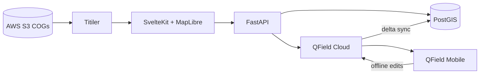

# DDA Product

A watershed-first toolkit for diagnosing field conditions, designing interventions, and
assessing outcomes. AWS COG base layers → SvelteKit web map → PostGIS vector storage → QField
offline sync.

The product is organized into three modules, each with its own data and API namespace:

| Module | Status | Description |
|--------|--------|-------------|
| **Diagnose** | Available | Map watersheds, draw observation zones, capture geotagged field notes, sync offline via QField |
| **Design** | Boilerplate | Plan and design interventions on top of diagnosed watersheds |
| **Assess** | Boilerplate | Track outcomes and assess impact of implemented designs |

## Architecture



| Component | Role |
|-----------|------|
| **S3 + Titiler** | Serve COG rasters as map tiles |
| **SvelteKit** | Landing page + per-module UIs (Diagnose today; Design/Assess boilerplate) |
| **PostGIS** | Diagnose module owns `diagnosis` (projects), `observation_zones` (polygons + text), `field_notes` (geotag + text/photo) |
| **QField Cloud** | Package a diagnosis project for mobile; sync offline edits back to PostGIS |

## Repository structure

```
geo-field-pipeline/
├── backend/                        # FastAPI app + infra
│   ├── app/
│   │   ├── main.py                 # Router registration, CORS
│   │   ├── shared/                 # Cross-module infra: config, DB, S3, watershed lookup
│   │   └── modules/
│   │       ├── diagnose/           # routers + services: projects, layers, observation
│   │       │   │                   # zones, field notes, QField sync
│   │       │   └── qgis/           # QGIS project build script + templates (Diagnose-only)
│   │       ├── design/             # boilerplate router (/api/design)
│   │       └── assess/             # boilerplate router (/api/assess)
│   ├── db/init.sql                 # PostGIS schema
│   ├── docker-compose.yml          # PostGIS, Titiler, API
│   └── Dockerfile
└── frontend/                       # SvelteKit + MapLibre
    └── src/
        ├── routes/
        │   ├── +page.svelte        # Landing page (nav to Diagnose/Design/Assess)
        │   ├── diagnose/            # Project picker + /diagnose/[slug] map view
        │   ├── design/              # Boilerplate page
        │   └── assess/              # Boilerplate page
        └── lib/
            ├── shared/              # Cross-module infra: layout, pickers, API client, slug utils
            └── modules/
                ├── diagnose/        # Components, API client, map constants
                ├── design/          # (scaffold, ready for Design UI)
                └── assess/          # (scaffold, ready for Assess UI)
```

## Quick start

### 1. Configure environment

```bash
cd backend
cp .env.example .env
# Edit .env with your AWS credentials, S3 bucket, COG keys, and QField Cloud token
```

Get a QField Cloud token at [app.qfield.cloud/user/settings](https://app.qfield.cloud/user/settings/).

### 2. Start backend services

```bash
cd backend
docker compose up -d
```

This starts:
- **PostGIS** on `localhost:5432` (database `dda_product`)
- **Titiler** on `localhost:8000` (reads COGs from S3)
- **API** on `localhost:8080`

### 3. Start frontend

```bash
cd frontend && npm run dev
```

Open [http://localhost:5173](http://localhost:5173) for the landing page, or go straight to
[http://localhost:5173/diagnose](http://localhost:5173/diagnose).

## Usage (Diagnose)

### Projects

1. Open `/diagnose` — you'll see existing projects or **New project**
2. Enter a name and click the map to set a location
3. The app looks up the watershed from `watersheds.fbg` on S3 and creates the project
4. The map opens (at `/diagnose/{project-slug}`) zoomed to that watershed; LULC is clipped to
   the watershed bounds

### Web map (inside a project)

- **Pan** — navigate the map
- **+** button — draw an observation zone (polygon) with a label and description
- **Field Note** — click a location, enter text and optionally attach a photo
- **Package to QField** — packages the **current project** (watershed-clipped LULC as MBTiles +
  project-scoped vectors) to QField Cloud

### QField mobile

1. Sign in to your QField Cloud account in the QField app
2. Download the project (named `{QFIELD_PROJECT_NAME}-{your-project-name}`)
3. Edit **Observation zones** and **Field notes** offline
4. Sync when back online — changes push as deltas to PostGIS

## PostGIS schema

**diagnosis** — `name`, `watershed_id`, `watershed_name`, `watershed_geom`, seed coordinates
**observation_zones** — `project_id` (→ `diagnosis`), `geom` (polygon/multipolygon only), `text`, `description`, `color`
**field_notes** — `project_id` (→ `diagnosis`), point `geom`, `text`, optional `photo_path`/`audio_path`

## Important: PostGIS must be reachable from QField

For offline editing sync, QField Cloud applies deltas to your PostGIS database when the device
syncs. The database must be reachable at the host configured in `POSTGIS_PUBLIC_HOST` (a public
IP or domain — not `localhost`).

For local development, use a tunnel (e.g. ngrok, Cloudflare Tunnel) or deploy PostGIS to a cloud
VM.

## API endpoints

### Diagnose (`/api/diagnose/...`)

| Method | Path | Description |
|--------|------|-------------|
| GET | `/api/diagnose/projects` | List diagnosis projects |
| POST | `/api/diagnose/projects` | Create project (name + coordinate → watershed lookup) |
| GET | `/api/diagnose/projects/{id}` | Get project with watershed geometry |
| POST | `/api/diagnose/watersheds/lookup` | Preview watershed at a coordinate |
| GET | `/api/diagnose/layers/cog?bbox=w,s,e,n` | COG layers clipped to bbox |
| GET/POST/PATCH/DELETE | `/api/diagnose/observation-zones?project_id=` | Project-scoped observation zones (polygons only) |
| GET/POST/PATCH/DELETE | `/api/diagnose/field-notes?project_id=` | Project-scoped field notes |
| POST | `/api/diagnose/qfield/package` | Package current project to QField (`{project_id}`) |
| POST | `/api/diagnose/qfield/sync` | Sync offline edits from QField Cloud back into PostGIS |

### Design / Assess (boilerplate)

| Method | Path | Description |
|--------|------|-------------|
| GET | `/api/design/status` | Placeholder status endpoint |
| GET | `/api/assess/status` | Placeholder status endpoint |

## Next steps

- Build out the Design and Assess data models, routers, and UIs
- Add more layers to the diagnose piece
- Deploy for production